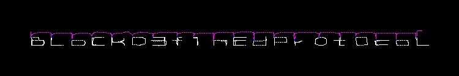

# Hackit 3

We are just given a [dump](dump) file.

A file check tells us it's a PCAP file:

```sh
$ file dump
dump: pcap capture file, microsecond ts (little-endian) - version 2.4 (Linux cooked v1, capture length 262144)
```

Checking for strings yields the following result:

```sh
$ strings -12 dump
generic.movementSpeed?
generic.movementSpeed?
```

Opening the file with Wireshark or analyzing it with Scapy we can get some additional relevant information:

```python
>>> x = rdpcap('dump')
>>> x
<dump: TCP:9844 UDP:0 ICMP:0 Other:0>
>>> x[0].dport
25565
```

With both the string and the port used we can deduce it's a Minecraft capture.  
Knowing this, we attempted to use a Minecraft dissector for Wireshark,
but the ones available are too old and don't work properly.

This is quite understandable considering that the Minecraft protocol is rather unstable,
the captured session corresponds to the version 404 of the protocol, which is the current stable one at the time of writing this.

So, we considered using some existing tool unfeasible and just went and learnt about the protocol,
which is quite comprehensibly defined at https://wiki.vg/Protocol

After dealing for a while with both `VarInt` specification and packet format
(according to https://wiki.vg/Protocol#Without_compression, we should only see a single length field,
but we were seeing two of them, as defined in https://wiki.vg/Protocol#With_compression,
even for uncompressed data), we saw that only a reduced subset of the packet types were being used, most notably:

- from client to server:
  - player position
  - player position and look
  - player look
- from server to client:
  - chunk_data
  - unload_chunk

So, basically, client to server communication consists in information about the player and
server to client communication consists in information about the map.

We initially thought the flag could be in the map, so we reversed the server to client communication first.  
After dealing with the chunk format, analyzing their bitmasks, palettes, positions, lights and biomes we realized
there was no simple way to get the flag from there, so we switched to look at the client messages.

After decoding client messages, the position of the player seemed like the most relevant information.
It consists in the 3D coordinates (`X`, `Y`, `Z`, with `Y` being the height)
and a boolean flag indicating whether the player is in the ground.

We saw how the position of the player was continously changing,
so drawing that position seems like a good idea.
Minecraft is 3D though, so we have to consider if we want to draw positions in 3D or use a simpler 2D.

Analyzing the height coord (`Y`), we could see how it barely changed
(it was either `4.0` or `5.0`, unless the player was not in ground),
so we decided to draw it in 2D,
using different colors to indicate player height and whether it was on ground.

We used `pygame` to draw it, resulting in the following image:



As can be seen there, the flag is `BLoCkD3f1nEdPr0tOcoL`.

The code we used to get the flag is available at [hackit3.py](hackit3.py).
