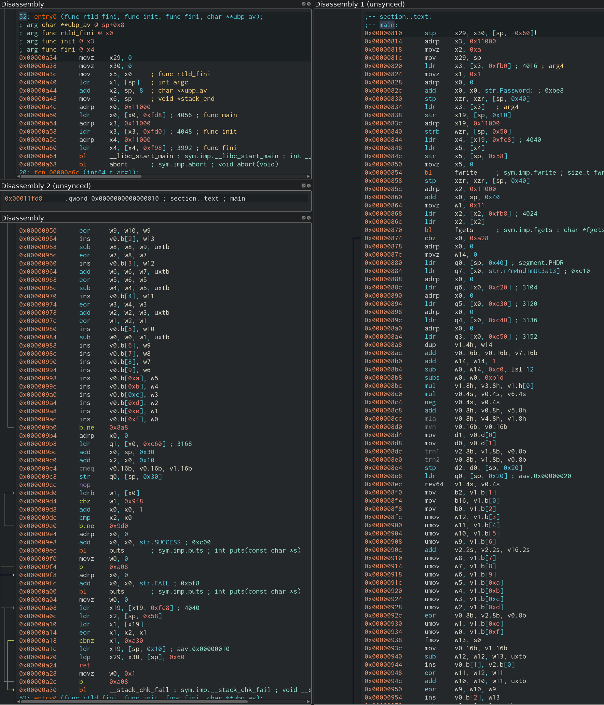
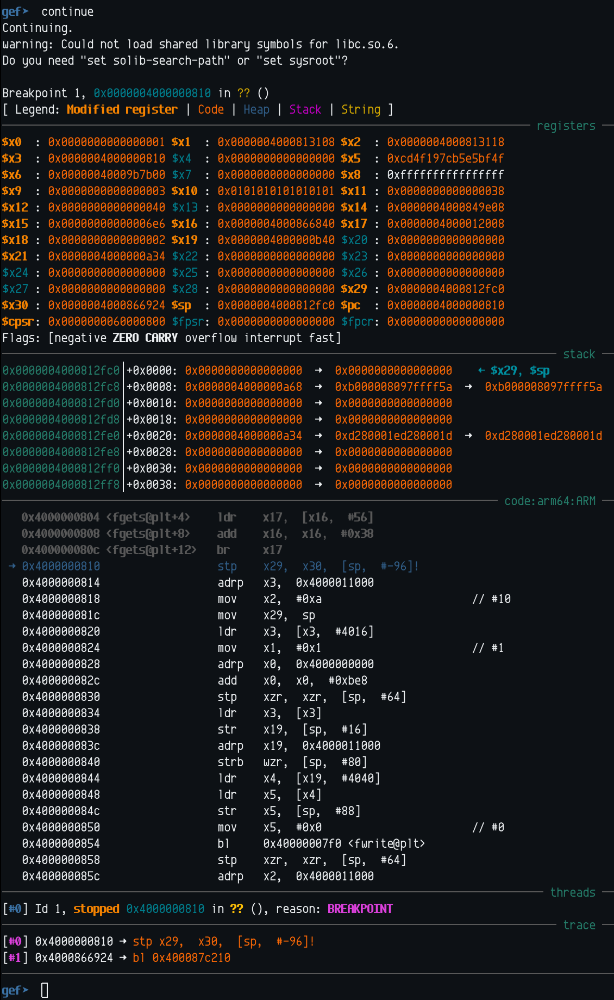

# Hackit 3

This is the last level of the [Gipuzkoa Encounter 14](https://ge14.gipuzkoaencounter.org/) hackit.
The event was transformed into a remote event due to COVID-19 in a rush, yet it went perfectly fine.
Kudos to the organization for the quick and great response!

The challenge consists in just the [cambridge_technology](cambridge_technology) file,
accompanied by the message _To finish, a classic_.
The message already suggests that it's a crackme,
as we'll soon confirm.

## Static analysis

The first thing we do is to check the type of file:

```sh
$ file cambridge_technology
cambridge_technology: ELF 64-bit LSB pie executable, ARM aarch64, version 1 (SYSV), dynamically linked, interpreter /lib/ld-linux-aarch64.so.1, for GNU/Linux 3.7.0, stripped
```

So, it seems it's an [AArch64](https://en.wikipedia.org/wiki/ARM_architecture#AArch64) binary.

Let's disassemble it and look at the asm code:



On the top-left window we can see the binary's entry point.
We can see there at `0xa50` how the main function address is taken from the offset `0x11fd8`,
which is shown in the window below pointing to the address `0x810`,
which is the beginning of the text section
and consists in the main function, which contains all the relevant logic of the program.

The first part of the code of the main function is shown in the right window,
and the second part is shown in the bottom-left window.
We can distinguish 4 different parts in the code:

1. Instructions 0x810 - 0x874.
   Initial input/output code (with error handling at 0xa28 - 0xa2c).
   This code prints `Password: ` and reads the password
   to a string of 17 bytes.
   Since strings finish with `0`, it'll be at most 16 byte (128 bits) long.
2. Instructions 0x878 - 0x8a4. Initialization of variables.
   This code initializes `w14` to `0` (`w14` will be the next loop index),
   then it loads the password into the `q0` register (16B).
   It also initializes the registers `q3` to `q7` to some values taken from memory.
3. Instructions 0x8a8 - 0x9b0. The transformation loop.
   This code applies a series of transformations to the register `q0`,
   using helper registers `q1`, `q2` and `w0` to `w13`.
4. Instructions 0x9b4 - 0xa24. Checksum comparison.
   The result of the operations done in the loop is compared against a checksum
   printing a different result depending on the comparison
   (either `FAIL!` or `SUCCESS!`).

### Neon and registers

This code uses ARM's SIMD instruction set, called [Neon](https://developer.arm.com/architectures/instruction-sets/simd-isas/neon/neon-programmers-guide-for-armv8-a/introducing-neon-for-armv8-a/fundamentals-of-armv8-neon-technology).
The way Neon works is pretty simple, but register naming can cause some confusion.
As a quick summary for what we need, [AArch64 has the following registers](https://developer.arm.com/architectures/learn-the-architecture/armv8-a-instruction-set-architecture/registers-in-aarch64-general-purpose-registers):

- 31 general purpose registers, which can be used as 32bit registers (`w0`..`w30`) and 64bit registers (`x0`..`x30`).
- 32 floating-point / SIMD registers (`v0`..`v31`), which can be used as:
  - 8bit registers (`b`yte) (`b0`..`b31`)
  - 16bit registers (`h`alf) (`h0`..`h31`)
  - 32bit registers (`s`ingle) (`s0`..`s31`)
  - 64bit registers (`d`ouble) (`d0`..`d31`)
  - 128bit registers (`q`uad) (`q0`..`q31`)
  Additionally, small registers allow random access, so they can be indexed (e.g. `v0.b[0]..v0.b[15]`).

## Dynamic analysis

Once I understood the overall picture of what the binary did,
I thought that only using static analysis may be too hard,
especially since it was the first time I was reversing code involving Neon,
so the possibility of getting things wrong was pretty high.

### Executing the binary

So, the first step is to actually be able to execute the binary.
We can do this with the almighty [qemu](https://www.qemu.org/),
but we also need a aarch64 libc and loader.

You can get full instructions and the binaries from [this great post](https://ughe.github.io/2018/07/19/qemu-aarch64).

```sh
$ qemu-aarch64 cambridge_technology
Password: AAAAAAAAAAAAAAAA
FAIL!
```

Nice, it seems to work!
Unfortunately, I didn't get the correct password on the first guess... so time for next step.

### Debugging the binary

QEMU includes an option to provide a gdb stub,
so a gdb process can be attached remotely to debug the binary.

```sh
$ qemu-aarch64 -g 1234 cambridge_technology
```

Now we need gdb with aarch64 target support.
Additionally, we'll also use [gef](https://github.com/hugsy/gef)
to help us make debugging a bit easier.

```sh
$ aarch64-linux-gnu-gdb cambridge_technology
```

Once inside `gdb` we set the remote target
and a breakpoint at the beginning of the interesting code,
and continue running the program

```gdb
gef➤ b *0x4000000810
Breakpoint 1 at 0x4000000810
gef➤  target remote 127.0.0.1:1234
Remote debugging using 127.0.0.1:1234
[...]
gef➤  continue
```

When the debugger stops at the breakpoint,
it looks like this:



At this point, everything is ready to
actually start reversing the code.

## Reversing the code

The approach I followed to reverse the code was to manually decompile it.
That is, writing a C program with the same logic that produces the same output.
We can confirm that the reversed logic is correct by checking precisely that output match.
In this specific case, after the loop ends we should have the same contents in our output
as we have in the `q0` register.

A decompiler can usually do this step automatically,
but in this case `ghidra` decompiler's output was crap,
I guess it's due to lack of proper support for AArch64 SIMD.

The resulting code looks like this:

```c
#include <stdint.h>
#include <stdio.h>

typedef uint8_t u8;
typedef uint16_t u16;
typedef uint32_t u32;
typedef uint64_t u64;

void print(u8 *q) {
  for (int i = 0; i < 0x10; i++) printf("%x ", q[i]);
  printf("\n");
}

int main() {
  u8 q0[0x10], q1[0x10], q2[0x10], q16[0x10];
  u8 q3[0x10] = {0x69, 0x30, 0xfc, 0x30, 0x93, 0x30, 0x68, 0x30, 0xb3, 0x30, 0xa4, 0x30, 0xc3, 0x30, 0x06, 0x26};
  u8 q4[0x10] = {0x4f, 0x7a, 0x84, 0x30, 0x4b, 0x30, 0x58, 0x30, 0x83, 0x30, 0x6a, 0x30, 0x44, 0x30, 0x01, 0xff};
  u8 q5[0x10] = {0xd9, 0x68, 0x1e, 0x88, 0xbe, 0xcf, 0xb6, 0xcf, 0xbc, 0xcf, 0x11, 0xac, 0xe5, 0x9e, 0xbc, 0xcf};
  u8 q6[0x10] = {0xb3, 0xba, 0xfe, 0xca, 0xef, 0xbe, 0xad, 0xde, 0xed, 0xa5, 0x53, 0xd1, 0x37, 0x13, 0xde, 0xc0};
  u8 q7[0x10] = "r4m4nd1mUt3at3!!";
  u32 w0, w1, w2, w3, w4, w5, w6, w7, w8, w9, w10, w11, w12, w13;
  u8 expected[0x10] = {0x81, 0x0c, 0xff, 0xdf, 0xbf, 0xb9, 0x07, 0xa8, 0xbf, 0x5b, 0xc2, 0x37, 0x7f, 0xcc, 0x6a, 0xbf};
  u8 flag[0x11];
  printf("Password: ");
  fgets(flag, 0x11, stdin);
  for (int i = 0; i < 0x10; i++) q0[i] = flag[i];
  for (int i = 0; i <= 0xc0b1c; i++) {
    // dup    v1.4h,  w14    
    for (int j = 0; j < 4; j++) *((u16 *)q1+j) = i;
    for (int j = 8; j < 0x10; j++) q1[j] = 0;
    // add    v0.16b,  v0.16b,  v7.16b
    for (int j = 0; j < 0x10; j++) q0[j] += q7[j];
    // mul    v1.8h,  v3.8h,  v1.h[0]
    u16 x = *(u16 *)q1;
    for (int j = 0; j < 8; j++) *((u16 *)q1+j) = *((u16 *)q3+j) * x;
    // mul    v0.4s,  v0.4s,  v6.4s
    for (int j = 0; j < 4; j++) *((u32 *)q0+j) *= *((u32 *)q6+j);
    // neg    v0.4s,  v0.4s
    for (int j = 0; j < 4; j++) *((u32 *)q0+j) = ~*((u32 *)q0+j)+1;
    // add    v0.8h,  v0.8h,  v5.8h
    for (int j = 0; j < 8; j++) *((u16 *)q0+j) += *((u16 *)q5+j);
    // mla    v0.8h,  v4.8h,  v1.8h
    for (int j = 0; j < 8; j++) *((u16 *)q0+j) += *((u16 *)q4+j) * *((u16 *)q1+j); 
    // mvn    v0.16b,  v0.16b
    for (int j = 0; j < 16; j++) q0[j] ^= 0xff;
    // mov    d1,  v0.d[0]
    *(u64 *)q1 = *(u64 *)q0, *((u64 *)q1+1) = 0;
    // mov    d0,  v0.d[1]
    *(u64 *)q0 = *((u64 *)q0+1), *((u64 *)q0+1) = 0;
    // trn1   v2.8b,  v1.8b,  v0.8b
    for (int j = 0; j < 16; j += 2) q2[j] = q1[j], q2[j+1] = q0[j];
    // trn2   v0.8b,  v1.8b,  v0.8b
    for (int j = 0; j < 16; j += 2) q0[j] = q1[j+1], q0[j+1] = q0[j+1];
    // stp    d2,  d0,  [sp,  #32]
    // ldr    q0,  [sp,  #32]
    *((u64 *)q0+1) = *(u64 *)q0;
    *(u64 *)q0 = *(u64 *)q2;
    // rev64  v1.4s,  v0.4s
    for (int j = 0; j < 2; j++)
      for (int k = 0; k < 2; k++)
        *((u32 *)q1+j*2+1-k) = *((u32 *)q0+j*2+k);
    // b2,  v1.b[1]
    q2[0] = q1[1];
    for (int j = 1; j < 0x10; j++) q2[j] = 0;
    // mov    b16,  v1.b[0]
    q16[0] = q1[0];
    for (int j = 1; j < 0x10; j++) q16[j] = 0;
    // mov    b0,  v1.b[2]
    q0[0] = q1[2];
    for (int j = 1; j < 0x10; j++) q0[j] = 0;
    // umov   w12,  v1.b[3]
    w12 = q1[3];
    // umov   w11,  v1.b[4]
    w11 = q1[4];
    // umov   w10,  v1.b[5]
    w10 = q1[5];
    // umov   w9,  v1.b[6]
    w9 = q1[6];
    // add    v2.2s,  v2.2s,  v16.2s
    for (int j = 0; j < 2; j++) *((u32 *)q2+j) += *((u32 *)q16+j);
    // umov   w8,  v1.b[7]
    w8 = q1[7];
    // umov   w7,  v1.b[8]
    w7 = q1[8];
    // umov   w6,  v1.b[9]
    w6 = q1[9];
    // umov   w5,  v1.b[10]
    w5 = q1[10];
    // umov   w4,  v1.b[11]
    w4 = q1[11];
    // umov   w3,  v1.b[12]
    w3 = q1[12];
    // umov   w2,  v1.b[13]
    w2 = q1[13];
    // eor    v0.8b,  v2.8b,  v0.8b
    for (int j = 0; j < 0x10; j++) q0[j] ^= q2[j];
    // umov   w1,  v1.b[14]
    w1 = q1[14];
    // umov   w0,  v1.b[15]
    w0 = q1[15];
    // fmov   w13,  s0
    w13 = *(u32 *)q0;
    // mov    v0.16b,  v1.16b
    for (int j = 0; j < 0x10; j++) q0[j] = q1[j];
    // sub    w12,  w12,  w13,  uxtb
    w12 -= w13 & 0xff;
    // mov    v0.b[1],  v2.b[0]
    q0[1] = q2[0];
    // eor    w11,  w12,  w11
    w11 ^= w12;
    // add    w10,  w10,  w11,  uxtb
    w10 += w11 & 0xff;
    // eor    w9,  w10,  w9
    w9 ^= w10;
    // mov    v0.b[2],  w13
    q0[2] = w13;
    // sub    w8,  w8,  w9,  uxtb
    w8 -= w9 & 0xff;
    // eor    w7,  w8,  w7
    w7 ^= w8;
    // mov    v0.b[3],  w12
    q0[3] = w12;
    // add    w6,  w6,  w7,  uxtb
    w6 += w7 & 0xff;
    // eor    w5,  w6,  w5
    w5 ^= w6;
    // sub    w4,  w4,  w5,  uxtb
    w4 -= w5 & 0xff;
    // mov    v0.b[4],  w11
    q0[4] = w11;
    // eor    w3,  w4,  w3
    w3 ^= w4;
    // add    w2,  w2,  w3,  uxtb
    w2 += w3 & 0xff;
    // eor    w1,  w2,  w1
    w1 ^= w2;
    // mov    v0.b[5],  w10
    q0[5] = w10;
    // sub    w0,  w0,  w1,  uxtb
    w0 = (w0 & 0xff) - (w1 & 0xff);
    // mov    v0.b[6],  w9
    q0[6] = w9;
    // mov    v0.b[7],  w8
    q0[7] = w8;
    // mov    v0.b[8],  w7
    q0[8] = w7;
    // mov    v0.b[9],  w6
    q0[9] = w6;
    // mov    v0.b[10],  w5
    q0[10] = w5;
    // mov    v0.b[11],  w4
    q0[11] = w4;
    // mov    v0.b[12],  w3
    q0[12] = w3;
    // mov    v0.b[13],  w2
    q0[13] = w2;
    // mov    v0.b[14],  w1
    q0[14] = w1;
    // mov    v0.b[15],  w0
    q0[15] = w0;
  }
  print(q0);

  for (int i = 0; i < 0x10; i++)
    if (flag[i] != expected[i]) {
      puts("FAIL!");
      return 0;
    }
  puts("SUCCESS!");
}
```

The different parts of the code we discussed above become clear now.
Variables are named after the registers where they are stored
(except for `flag` and `expected` which are stored in the stack).
Inside the loop every operation includes the comment of the assembly code
followed by the equivalent C code.
Additionally, at the end of the processing `q0` register we print
in order to compare with the actual register contents in the debugging session,
this code is not in the original binary, obviously.

The above code is available at [reversed-forward.c](reversed-forward.c).
We can compile and run it to see the actual results of the register
for the input we prefer to provide:

```
> aarch64-linux-gnu-gcc reversed-forward.c
>  qemu-aarch64 ./a.out
Password: AAAAAAAAAAAAAAAA
ea 35 43 d6 1b 47 0 1c 2c a1 c3 59 b2 46 ca 75
FAIL!
```

We can easily confirm with the debug session that the output of the register is the expected one,
so we have correctly reversed what the code does, and we now have it in code form.

If we look the above code in more detail,
we can easily confirm that all the operations are invertible,
so that's what we actually need to do.
If we start with the expected output in `q0` and invert all the operations
we should have the actual password at the end of the process.

We can also notice that the above code can be simplified a bit.
So we can first simplify the code a bit,
now that we can confirm that our simplifications are correct easily.
A simplified version looks like this:

```c
#include <stdint.h>
#include <stdio.h>

typedef uint8_t u8;
typedef uint16_t u16;
typedef uint32_t u32;
typedef uint64_t u64;

void print(u8 *q) {
  for (int i = 0; i < 0x10; i++) printf("%x ", q[i]);
  printf("\n");
}

int main() {
  u8 q0[0x10], q1[0x10], q2[0x10];
  u8 q3[0x10] = {0x69, 0x30, 0xfc, 0x30, 0x93, 0x30, 0x68, 0x30, 0xb3, 0x30, 0xa4, 0x30, 0xc3, 0x30, 0x06, 0x26};
  u8 q4[0x10] = {0x4f, 0x7a, 0x84, 0x30, 0x4b, 0x30, 0x58, 0x30, 0x83, 0x30, 0x6a, 0x30, 0x44, 0x30, 0x01, 0xff};
  u8 q5[0x10] = {0xd9, 0x68, 0x1e, 0x88, 0xbe, 0xcf, 0xb6, 0xcf, 0xbc, 0xcf, 0x11, 0xac, 0xe5, 0x9e, 0xbc, 0xcf};
  u8 q6[0x10] = {0xb3, 0xba, 0xfe, 0xca, 0xef, 0xbe, 0xad, 0xde, 0xed, 0xa5, 0x53, 0xd1, 0x37, 0x13, 0xde, 0xc0};
  u8 q7[0x10] = "r4m4nd1mUt3at3!!";
  u8 expected[0x10] = {0x81, 0x0c, 0xff, 0xdf, 0xbf, 0xb9, 0x07, 0xa8, 0xbf, 0x5b, 0xc2, 0x37, 0x7f, 0xcc, 0x6a, 0xbf};
  u8 flag[0x11];
  printf("Password: ");
  fgets(flag, 0x11, stdin);
  for (int i = 0; i < 0x10; i++) q0[i] = flag[i];
  for (int i = 0; i <= 0xc0b1c; i++) {
    for (int j = 0; j < 4; j++) *((u16 *)q1+j) = i;
    for (int j = 8; j < 0x10; j++) q1[j] = 0;
    for (int j = 0; j < 0x10; j++) q0[j] += q7[j];
    u16 x = *(u16 *)q1;
    for (int j = 0; j < 8; j++) *((u16 *)q1+j) = *((u16 *)q3+j) * x;
    for (int j = 0; j < 4; j++) *((u32 *)q0+j) *= *((u32 *)q6+j);
    for (int j = 0; j < 4; j++) *((u32 *)q0+j) = ~*((u32 *)q0+j)+1;
    for (int j = 0; j < 8; j++) *((u16 *)q0+j) += *((u16 *)q5+j);
    for (int j = 0; j < 8; j++) *((u16 *)q0+j) += *((u16 *)q4+j) * *((u16 *)q1+j); 
    for (int j = 0; j < 16; j++) q0[j] ^= 0xff;
    *(u64 *)q1 = *(u64 *)q0, *((u64 *)q1+1) = 0;
    *(u64 *)q0 = *((u64 *)q0+1), *((u64 *)q0+1) = 0;
    for (int j = 0; j < 16; j += 2) q2[j] = q1[j], q2[j+1] = q0[j];
    for (int j = 0; j < 16; j += 2) q0[j] = q1[j+1], q0[j+1] = q0[j+1];
    *((u64 *)q0+1) = *(u64 *)q0, *(u64 *)q0 = *(u64 *)q2;
    for (int j = 0; j < 2; j++)
      for (int k = 0; k < 2; k++)
        *((u32 *)q1+j*2+1-k) = *((u32 *)q0+j*2+k);
    u8 a = q1[0], b = q1[1], c = q1[2];
    b += a;
    c ^= b;
    for (int j = 0; j < 0x10; j++) q0[j] = q1[j];
    q0[1] = b;
    q0[2] = c;
    q0[3] -= c;
    q0[4] ^= q0[3];
    q0[5] += q0[4];
    q0[6] ^= q0[5];
    q0[7] -= q0[6];
    q0[8] ^= q0[7];
    q0[9] += q0[8];
    q0[10] ^= q0[9];
    q0[11] -= q0[10];
    q0[12] ^= q0[11];
    q0[13] += q0[12];
    q0[14] ^= q0[13];
    q0[15] -= q0[14];
  }
  print(q0);
  for (int i = 0; i < 0x10; i++)
    if (q0[i] != expected[i]) {
      puts("FAIL!");
      return 0;
    }
  puts("SUCCESS!");
}
```

This code is available at (reversed-forward-simplified.c)[reversed-forward-simplified.c]
We can confirm that the output haven't changed:

```
> aarch64-linux-gnu-gcc reversed-forward-simplified.c
>  qemu-aarch64 ./a.out
Password: AAAAAAAAAAAAAAAA
ea 35 43 d6 1b 47 0 1c 2c a1 c3 59 b2 46 ca 75
FAIL!
```

The code that inverts the logic looks like this:

```c
#include <stdint.h>
#include <stdio.h>

typedef uint8_t u8;
typedef uint16_t u16;
typedef uint32_t u32;
typedef uint64_t u64;

u64 modinv(u64 a, u64 b) {
  u64 b0 = b, t, q;
  u64 x0 = 0, x1 = 1;
  if (b == 1) return 1;
  while (a > 1) {
    q = a / b;
    t = b, b = a % b, a = t;
    t = x0, x0 = x1 - q * x0, x1 = t;
  }
  return x1;
}

int main() {
  u8 q1[0x10], q2[0x10];
  u8 q0[0x11] = {0x81, 0x0c, 0xff, 0xdf, 0xbf, 0xb9, 0x07, 0xa8, 0xbf, 0x5b, 0xc2, 0x37, 0x7f, 0xcc, 0x6a, 0xbf, 0x00};
  u8 q3[0x10] = {0x69, 0x30, 0xfc, 0x30, 0x93, 0x30, 0x68, 0x30, 0xb3, 0x30, 0xa4, 0x30, 0xc3, 0x30, 0x06, 0x26};
  u8 q4[0x10] = {0x4f, 0x7a, 0x84, 0x30, 0x4b, 0x30, 0x58, 0x30, 0x83, 0x30, 0x6a, 0x30, 0x44, 0x30, 0x01, 0xff};
  u8 q5[0x10] = {0xd9, 0x68, 0x1e, 0x88, 0xbe, 0xcf, 0xb6, 0xcf, 0xbc, 0xcf, 0x11, 0xac, 0xe5, 0x9e, 0xbc, 0xcf};
  u8 q6[0x10] = {0xb3, 0xba, 0xfe, 0xca, 0xef, 0xbe, 0xad, 0xde, 0xed, 0xa5, 0x53, 0xd1, 0x37, 0x13, 0xde, 0xc0};
  u8 q7[0x10] = "r4m4nd1mUt3at3!!";
  for (int i = 0xc0b1c; i >= 0; i--) {
    q0[15] += q0[14];
    q0[14] ^= q0[13];
    q0[13] -= q0[12];
    q0[12] ^= q0[11];
    q0[11] += q0[10];
    q0[10] ^= q0[9];
    q0[9] -= q0[8];
    q0[8] ^= q0[7];
    q0[7] += q0[6];
    q0[6] ^= q0[5];
    q0[5] -= q0[4];
    q0[4] ^= q0[3];
    u8 a = q0[0], b = q0[1], c = q0[2];
    q0[3] += c;
    for (int j = 0; j < 0x10; j++) q1[j] = q0[j];
    c ^= b;
    b -= a;
    q1[1] = b;
    q1[2] = c;
    for (int j = 0; j < 2; j++)
      for (int k = 0; k < 2; k++)
        *((u32 *)q0+j*2+1-k) = *((u32 *)q1+j*2+k);
    *(u64 *)q2 = *(u64 *)q0, *(u64 *)q0 = *((u64 *)q0+1);
    for (int j = 0; j < 16; j += 2) q1[j+1] = q0[j], q0[j+1] = q0[j+1];
    for (int j = 0; j < 16; j += 2) q1[j] = q2[j], q0[j] = q2[j+1];
    *((u64 *)q0+1) = *(u64 *)q0, *(u64 *)q0 = *(u64 *)q1;
    for (int j = 0; j < 16; j++) q0[j] ^= 0xff;
    for (int j = 0; j < 4; j++) *((u16 *)q1+j) = i;
    for (int j = 8; j < 0x10; j++) q1[j] = 0;
    u16 x = *(u16 *)q1;
    for (int j = 0; j < 8; j++) *((u16 *)q1+j) = *((u16 *)q3+j) * x;
    for (int j = 0; j < 8; j++) *((u16 *)q0+j) -= *((u16 *)q4+j) * *((u16 *)q1+j);
    for (int j = 0; j < 8; j++) *((u16 *)q0+j) -= *((u16 *)q5+j);
    for (int j = 0; j < 4; j++) *((u32 *)q0+j) = ~*((u32 *)q0+j)+1;
    for (int j = 0; j < 4; j++) *((u32 *)q0+j) *= modinv(*((u32 *)q6+j), 0x100000000);
    for (int j = 0; j < 0x10; j++) q0[j] -= q7[j];
  }
  printf("%s\n", q0);
}
```

This code is available at [reversed.c](reversed.c).
Compiling and running the code we get the valid password:

```sh
$ aarch64-linux-gnu-gcc reversed.c -O3
$ qemu-aarch64 ./a.out
n30nR3d4RM4tur3!
```

We can confirm that it works with the original binary:

```sh
$ qemu-aarch64 cambridge_technology
Password: n30nR3d4RM4tur3!
SUCCESS!
```

Yay!
