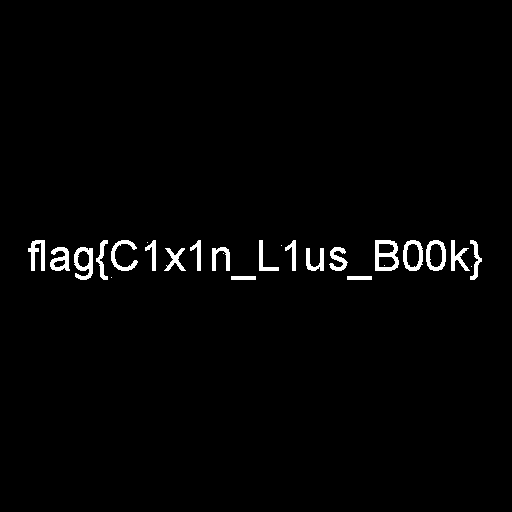

# Needle-Eye's Apprentice (misc 495)

The challenge provides the file [quadt.out](quadt.out).

Filename suggests a quadtree and description indicates the encoding (_He followed the path laid out for him, always clockwise and ever deeper_).

We write a [quadtree implementation](quadt.py) following the description and write the solution as an image: 
